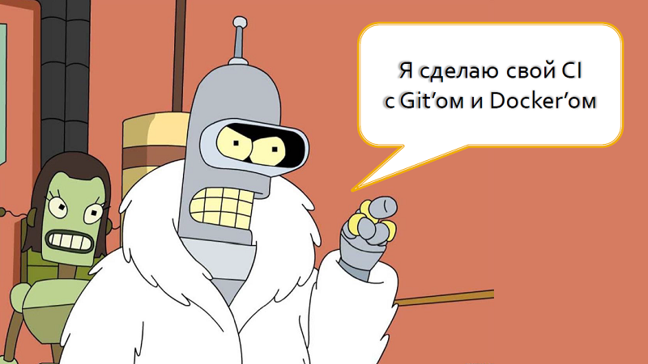

# Build as Code

введение в тему построения, тестирования и публикации приложений на подходе с контейнерной изоляцией и полностью описанном в коде на PowerShell или Nuke Build.

## Выступления

- 2023.09.16 — [DotNext 2023 Moscow](https://dotnext.ru/talks/6bf41f9f1d94439b8d7ba2233adbdaeb/) (Москва): [Слайды](../../dotnext2023msk/BuildAsCode/Build-as-Code.pdf), [Код](../../dotnext2023msk/BuildAsCode/Demo)
- 2023.05.25 — [SpbDotNet №88](https://spbdotnet.timepad.ru/event/2433139/) (Санкт-Петербург): [Слайды](../../spbdotnet88/BuildAsCode/Build-as-Code.pdf), [Код](../../spbdotnet88/BuildAsCode/Demo), [Видео](https://www.youtube.com/watch?v=yaQsQvPwlvg)

## Ссылки

- [docs.docker.com](https://docs.docker.com/)
- [nuke.build](https://nuke.build/)
