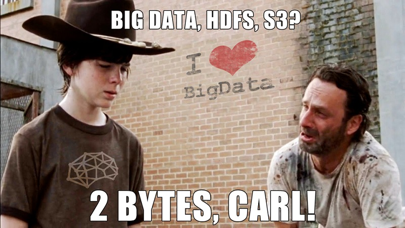

# The Metrix has you...

Introduction into Time Series and tools for .Net developers, such as InfluxDB and Grafana.

## Public Talks

`[2017-11-23]` [SpbDotNet, Saint Petersburg](https://spbdotnet.timepad.ru/event/610557/) ([Video](https://www.youtube.com/watch?v=pjmRqIgoyFE), [Pdf slides](../../spbdotnet24/Metrix/Metrix.pdf), [SlideShare slides](https://www.slideshare.net/SpbDotNet/the-metrix-has-you))  
`[2017-11-12]` [DotNext, Moscow](https://dotnext-moscow.ru/2017/msk/talks/2wij6mss4oea0mqi2g0ewk/) ([Video](https://www.youtube.com/watch?v=AFB89L8DLpE), [Pdf slides](../../dotnext2017/Metrix/Metrix.pdf))

## Links

### Time Series

- [Gorilla Paper](http://www.vldb.org/pvldb/vol8/p1816-teller.pdf)
- [Akumuli](http://akumuli.org/)
- [Run-length encoding](https://en.wikipedia.org/wiki/Run-length_encoding)
- [Varints](https://developers.google.com/protocol-buffers/docs/encoding#varints), [ZigZag](https://developers.google.com/protocol-buffers/docs/encoding#types)
- [Dynamic time warping](https://en.wikipedia.org/wiki/Dynamic_time_warping)
- [Sketch-based change detection](https://dl.acm.org/citation.cfm?id=948236)
- [Mobile Phone Based Drunk driving detection](https://www.slideshare.net/nagarajc007/mobile-drunk-driver-detection)

### Tools

- [InfluxData site](https://www.influxdata.com/)
- [Grafana site](https://grafana.com/)
- [App Metrics site](https://www.app-metrics.io/)